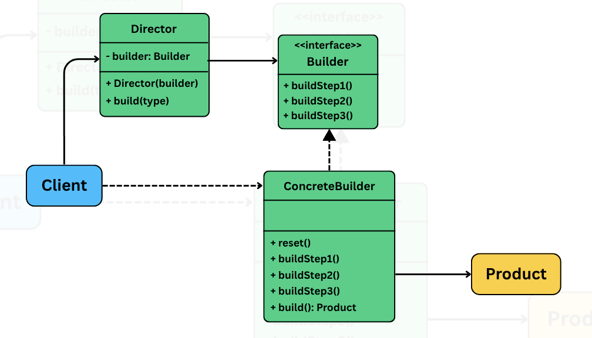

## Builder

> Lets us construct complex objects step by step, separating the construction logic from the final representation.

It is useful in situations where:
- An object requires **many optional fields**, not all of them are required all the time.
- **Avoid telescoping/large constructors** with multiple parameters.
- The object construction process involve **multiple steps that need to happen in a particular order**.

While building objects, developers often rely on constructors with many parameters or expose setters for every field. But as the no. of fileds grow, this approach becomes hard to manage, is error prone, violates SRP -- mixing construction logic with business logic.

The builder pattern solves this using a **separate builder class** that handles the object creation process. The client uses this builder to create objects step-by-step, while **keeping the final object immutable, consistent** and **easy to create**.

## The problem

Image a system the creates and configures HTTP requests. Each `HttpRequest` can contain a mix of required and optional fields depending on the use case. A typical HTTP request might include:

- URL (Required)
- HTTP method (defaults to GET)
- Headers (optional)
- Query parameters
- Request body
- Timeout

As the no. of optional fields increase, so does the complexity of object construction. A common approach is to use constructor overloading often a.k.a **telescoping constructor**. Define multiple constructor with increasing no. of parameters.

```java
class HttpRequestTelescoping {
    private String url;
    private String method;
    private Map<String, String> headers;
    private Map<String, String> queryParams;
    private String body;
    private int timeout;

    public HttpRequestTelescoping(String url) {
        this(url, "GET");
    }

    public HttpRequestTelescoping(String url, String method) {
        this(url, method, null);
    }

    public HttpRequestTelescoping(String url, String method, Map<String, String> headers) {
        this(url, method, headers, null);
    }

    // Rest of the constructors.
    // Getters could be added here
}

public class HttpAppTelescoping {
    public static void main(String[] args) {
        HttpRequestTelescoping req1 = new HttpRequestTelescoping("https://api.example.com/data");

        HttpRequestTelescoping req2 = new HttpRequestTelescoping(
            "https://api.example.com/submit",
            "POST",
            null,
            null,
            "{\"key\":\"value\"}"
        );

        HttpRequestTelescoping req3 = new HttpRequestTelescoping(
            "https://api.example.com/config",
            "PUT",
            Map.of("X-API-Key", "secret"),
            null,
            "config_data",
            5000
        );
    }
}
```

#### Hard to read and write

- Multiple parameters of the same type, makes it easy to accidentally swap arguments.
- Code is difficult to understand at a glance, especially when most of the parameters are `null`.

#### Error prone

- Clients must pass `null` for optional parameters they don't want to set, increasing the risk of bugs.
- Defensive programming becomes necessary to avoid `NullPointerException`.

#### Inflexible and fragile

- If we wish to set param 5 but not 3 and 4, we are forced to pass `null` for 3 and 4.
- We must follow the exact parameter order, which hurts readability and usability.

#### Poor scalability

- Adding a new optional parameter requires adding or changing a constructor, which may break existing code or force unnecessary updates to the client.
- Testing and documentation becomes increasingly difficult to maintain.

## Applying the pattern

- The construction logic is **encapsulated in a Builder**.
- The final object is create by a `build()` method.
- The object has private or package private constructor, forcing the construction through the builder.



### Builder (eg: HttpRequestBuilder)

- Defines methods to configure or setup the product.
- Typically returns `this` from each method to support a fluent interface.
- Often implemented as a static nested class inside product class.

### Concrete builder (eg: StandardHttpRequestBuilder)

- Implements the `Builder` interface or defines the fluent methods directly.
- Maintains state for each part of the product being built.
- Implements the `build()` method that returns the final product instance.

### Product (eg: HttpRequest)

- The final object being constructed.
- May be immutable and built only via Builder.
- Has a private constructor that takes in builder's internal state.

### Director (Optional, eg: HttpRequestDirector)

- Ochestrates the building process using the builder.
- The client can take on this role.

## What was achieved

- No need for long constructors or `null` arguments.
- Optional values are clearly named and easy to set.
- The final object is immutable and fully intialized.
- Readable and fluent client code.
- Adding optional fields is easy; add a new method to the builder.
