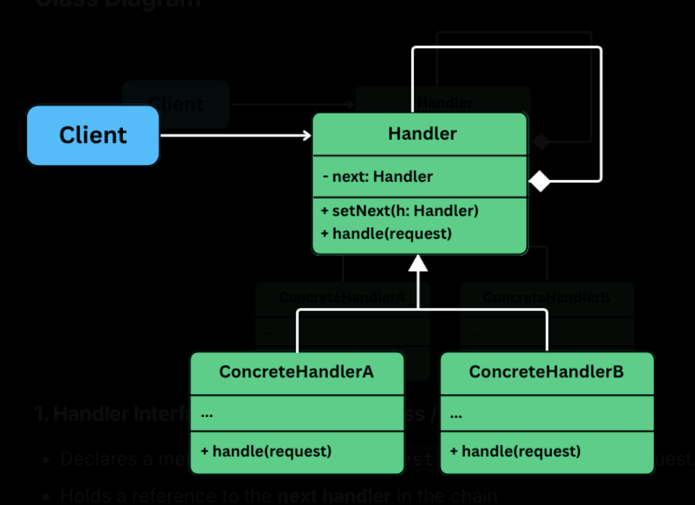

## Chain of responsbility

Is a behavioral pattern that lets you **pass requests along a chain of handlers**, allowing each handler to decide whether to process the request or pass it to the next handler in the chain.

It is useful in situations where:
- A request must be handled by one of many possible handlers, and we don't want the sender to be tightly coupled to any specific one.
- Decouple the request logic from the code that processes it.
- Flexibility to add, remove or re-order handlers w/o changing the client code.

When dealing with conditional request handling developers often resort to `if-else` or `switch` to determine how a request should be processed. Eg: a logging system might write to console, file or remote server depending on configuration. Or an HTTP request might need to go through validation, auth or rate-limiting steps.

But as the # conditions grow, this apporach becomes hard to scale, violates OCP. Turns logic into a tightly coupled, brittle monolith.

## The problem

Imagine building a backend server that processes incoming HTTP requests:

```java
class Request {
    public String user;
    public String userRole;
    public int requestCount;
    public String payload;

    public Request(String user, String role, int requestCount, String payload) {
        this.user = user;
        this.userRole = role;
        this.requestCount = requestCount;
        this.payload = payload;
    }
}
```

Each request must go through a sequence of processing steps, only after these checks the request can reach the actual business logic:
- Authentication
- Authorization
- Rate limiting
- Data validation

A typical first attempt might be to implement all logic inside a single class using a long chain of `if-else` or method calls.

```java
class RequestHandler {
    public void handle(Request request) {
        if (!authenticate(request)) {
            System.out.println("Request Rejected: Authentication failed.");
            return;
        }

        if (!authorize(request)) {
            System.out.println("Request Rejected: Authorization failed.");
            return;
        }

        if (!rateLimit(request)) {
            System.out.println("Request Rejected: Rate limit exceeded.");
            return;
        }

        if (!validate(request)) {
            System.out.println("Request Rejected: Invalid payload.");
            return;
        }

        System.out.println("Request passed all checks. Executing business logic...");
    }

    private boolean authenticate(Request req) {
        return req.user != null;
    }

    private boolean authorize(Request req) {
        return "ADMIN".equals(req.userRole);
    }

    private boolean rateLimit(Request req) {
        return req.requestCount < 100;
    }

    private boolean validate(Request req) {
        return req.payload != null && !req.payload.isEmpty();
    }
}
```

And the client code

```java
public class App {
    public static void main(String[] args) {
        Request req = new Request("john_doe", "ADMIN", 42, "{ 'data': 123 }");
        RequestHandler handler = new RequestHandler();
        handler.handle(req);
    }
}
```

#### Hard to extend or modify

If we wish to change the order of checks or add a new one (eg: logging, caching, metrics), we must modify the existing handler -- violating OCP.

#### Poor separation of concerns

All validation logic is tightly coupled inside single method. This violates SRP and makes the code harder to test and maintain.

#### No reusability

We can't reuse the individual checks in other parts of the system.

#### Inflexibile configurations

Want to skip auth for public APIs? Want to make validation optional in dev mode? We will have to write more if checks and bloat the handler.

### What we need

- Break each step into its **own unit of responsibility**.
- Let each step **decide whether to handle, pass or short circuit** the request.
- Allow each **handler to added, removed or reordered** w/o touching the existing logic.
- Keep our logic clean, testable and extensible.

## Applying the pattern

> The Chain of Responsibility Pattern allows a request to be passed along a chain of handlers.

The pattern turns individual processing step into standalone classes. These handlers are linked together to form a chain, the request flows through the chain until it is handled (or dropped).



### Handler interface (Abstract class / interface)

- Declares a method like `handle(request)` for processing the request.
- Hold a reference to the next handler in the chain via `setNext(handler)`.

### Concret handlers (eg: AuthHandler, RateLimitHandler)

Implement the handler interface. Each handler decides whether to:
- Handle the request (reject, log, transform).
- Or pass the request along to the next handler in the chain.

### Client

- Builds and connects the chain of handlers using `setNext()`.
- Sends the request to the first handler in the chain.
- Is unaware which handler will process the request.

## What was achieved

- Modularity: each handler is now isolated and easy to test.
- Loose coupling: handlers don't need to know who comes next.
- Extensibility: easily insert, remove, reorder handlers.
- Clean client code: only responsible for building the chain and send the request.
- OC compliant: can add new functionality (eg: logging) w/o touching existing code.
