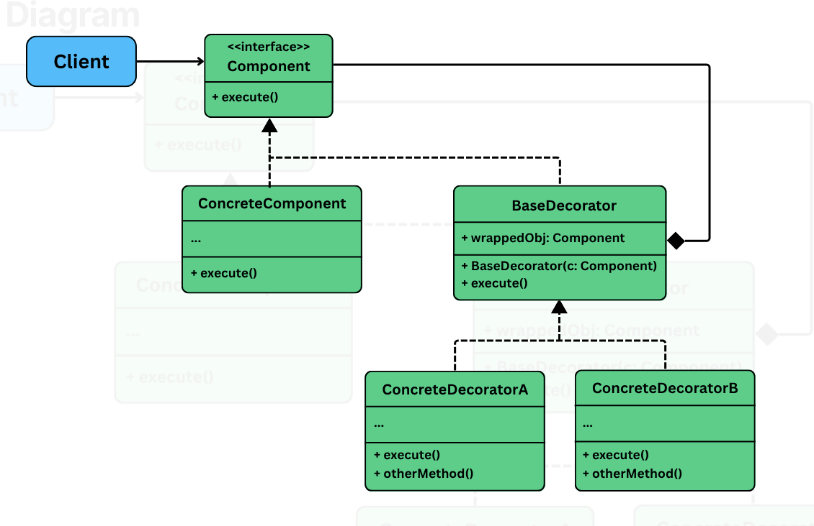

## Decorator

> Structural pattern that lets use dynamically add new behavior responsibilties to objects w/o modifying their underlying code.

It is useful in situations where:
- We want to **extend the functionality** of a class w/o subclassing it.
- We wish to **compose behaviors at runtime**, in various combinations.
- **Avoid bloated if-else** logic for optional features.

## The problem

We are building a text rendering system (word processor/ markdown). At the core the system is a `TextView` component that renders the plain text on the screen. Soon, the product evolves and we need bold, italic, underline, bordered text or any of these possible combination.

Naive approach would be to subclass for every combination

```java
interface TextView {
    void render(String text);
}

class BoldTextView extends TextView {
    @Override
    public void render(String text) {
        System.out.printf("<b>%s</b>", text);
    }
}

class BoldItalicTextView extends TextView {
    @Override
    public void render(String text) {
        System.out.printf("<b><i>%s</i></b>", text);
    }
}
```

#### Class explosion

For every combination of feature, we need to create a new subclass. This does not scale, with just 4 features we would end up creating 15 classes for all possible combinations.

#### Rigid design

We can't dynamically change features at runtime. Eg: want to turn bold on/off based on user preferences? We need conditional logic or object swapping.

#### Violates OCP

Every time a new feature `highlight/shadow` is introduced, we need to modify/extend existing classes -- which increases the chance of regression.

## Applying the pattern

> Allows to add responsibilities to the objects dynamically, w/o altering their structure or modifying their original code.



- **Component (eg: `TextView`)**: Declares the common interface for all core and decorated objects.
- **ConcreteComponent (eg: `PlainTextView`)**: The base object that can be dynamically decorated.
- **ConcreteDecorators (eg: BoldDecorator, ItalicDecorator, etc.)**: Extend the base decorator to add new functionality, before/after calling the wrapped component's method.
- **Client**: Creates and composes decorators at runtime to achieve the desired combination of behaviors.

> Real world example: Think of plain coffee. Add milk, sugar etc. Each addition enhances the original but doesn't change the base -- stacking behaviors while keeping the core intact.

## What was achieved

- **Dynamic layering**: We can add, remove or combine decorators at runtime.
- **Modular design**: Each decorator is focused on one formatting feature.
- **No class explosion**: Avoid creating subclasses for every combination.
- **OCP**: New formatting options can be added w/o modifying existing classes.
