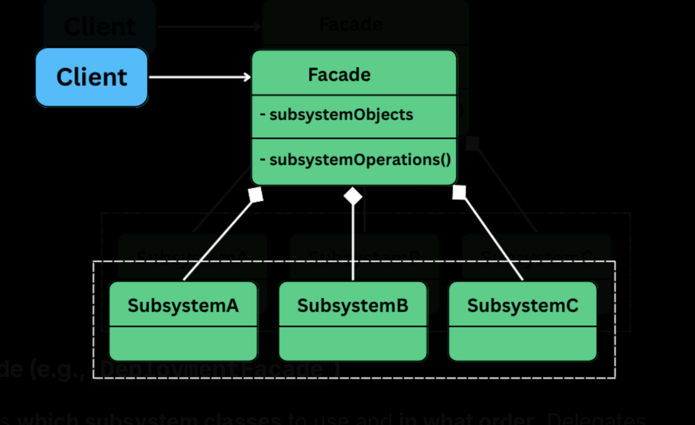

## Facade Design Pattern

Provides a unified/simplified interface to a complex subsystem; making it easier for the clients to interact with multiple components w/o getting overwhelmed by their intricacies.

It is useful when:
- The system consists of many interdependent classes or low level APIs.
- The client doesn't need to know - how those parts work internally.
- Reduce the coupling b/w the client and the complex system.

## Use case

#### Scenario #1

When building applications, we often need to interact with multipel components to achieve a single task. Eg: Deploying a new version of our app require calls to a build system, container service, monitoring tool, notification system -- all in a specific sequence.

We could write the logic in every client class, but it would quickly become error-prone, repetitive, and tighly coupled to internal details of each subsystem.

The facade pattern solves this by introducing a single entry point -- a facade that wraps the complex interactions behind a clean and easy-to-use interface.

#### Scenario #2

Or else, think of a high end hotel. As a guest (the client), you don't want to individually contact housekeeping for a fresh towel, the restaurant for dinner reservations, and the valet for your car.

Instead, we make a request to the concierge like - "I'd like dinner reservations at 8 PM and my car ready afterwards." The concierge then interacts with all the necessary hotel departments (the subsystem) to fulfill your request.

You, as the guest, are shielded from this internal complexity. The Concierge Desk provides a simplified interface to the hotel's services.

## The problem

Deploying an application may seem like a straightforward task but in reality, it involves a sequence of coordinated, error prone steps.
- Pull the code
- Build the project
- Run automated tests
- Deploy the build

Each of these can be handled by a separate class, each with its own specific API and config.

```java
class VersionControlSystem {
    public void pullLatestChanges(String branch) {
        System.out.println("VCS: Pulling latest changes from '" + branch + "'...");
        simulateDelay();
        System.out.println("VCS: Pull complete.");
    }

    private void simulateDelay() {
        try {
            Thread.sleep(1000);
        } catch (InterruptedException e) {
            e.printStackTrace();
        }
    }
}

class BuildSystem {
    public boolean compileProject() {
        System.out.println("BuildSystem: Compiling project...");
        simulateDelay(2000);
        System.out.println("BuildSystem: Build successful.");
        return true;
    }

    public String getArtifactPath() {
        String path = "target/myapplication-1.0.jar";
        System.out.println("BuildSystem: Artifact located at " + path);
        return path;
    }

    private void simulateDelay(int ms) {
        try {
            Thread.sleep(ms);
        } catch (InterruptedException e) {
            e.printStackTrace();
        }
    }
}

class TestingFramework {
    public boolean runUnitTests() {
        System.out.println("Testing: Running unit tests...");
        simulateDelay(1500);
        System.out.println("Testing: Unit tests passed.");
        return true;
    }

    public boolean runIntegrationTests() {
        System.out.println("Testing: Running integration tests...");
        simulateDelay(3000);
        System.out.println("Testing: Integration tests passed.");
        return true;
    }

    private void simulateDelay(int ms) {
        try {
            Thread.sleep(ms);
        } catch (InterruptedException e) {
            e.printStackTrace();
        }
    }
}

class DeploymentTarget {
    public void transferArtifact(String artifactPath, String server) {
        System.out.println("Deployment: Transferring " + artifactPath + " to " + server + "...");
        simulateDelay(1000);
        System.out.println("Deployment: Transfer complete.");
    }

    public void activateNewVersion(String server) {
        System.out.println("Deployment: Activating new version on " + server + "...");
        simulateDelay(500);
        System.out.println("Deployment: Now live on " + server + "!");
    }

    private void simulateDelay(int ms) {
        try {
            Thread.sleep(ms);
        } catch (InterruptedException e) {
            e.printStackTrace();
        }
    }
}
```

The `DeploymentOrchestrator` component will coordinate everything. It pulls in all subsystem and defines the exact sequence of operations to perform a deployment.

```java
class DeploymentOrchestrator {
    private VersionControlSystem vcs = new VersionControlSystem();
    private BuildSystem buildSystem = new BuildSystem();
    private TestingFramework testFramework = new TestingFramework();
    private DeploymentTarget deployTarget = new DeploymentTarget();

    public boolean deployApplication(String branch, String prodServer) {
        System.out.println("\n[Orchestrator] Starting deployment for branch: " + branch);

        vcs.pullLatestChanges(branch);

        if (!buildSystem.compileProject()) {
            System.err.println("Build failed. Deployment aborted.");
            return false;
        }

        String artifact = buildSystem.getArtifactPath();

        if (!testFramework.runUnitTests() || !testFramework.runIntegrationTests()) {
            System.err.println("Tests failed. Deployment aborted.");
            return false;
        }

        deployTarget.transferArtifact(artifact, prodServer);
        deployTarget.activateNewVersion(prodServer);

        System.out.println("[Orchestrator] Deployment successful!");
        return true;
    }
}
```

### What is wrong here

#### High client complexity

The `DeploymentOrchestrator` acts as our client -- it must be aware of every subsystem:
- What methods to call.
- In what sequence.
- What to do in success/failure scenarios.

This bloats the client and tightly couples it to the internal workings of the system.

#### Tight coupling b/w subsystems

Each subsystem is directly invoked from the subsystem. A change in any one of them, eg: `compileProject()` now takes ENV flags, will ripple through the orchestrator -- and potentially every other place its used.

#### Poor maintability

It violates the Single Responsibility Principle. The orchestrator needs to be updated everytime -- bloating it up with more logic and responsibilities.

#### Scattered workflow logic

If other parts of the system need to perform a deployment:
- We either duplicate the logic elsewhere, increasing chances of incosistency.
- We reuse the orchestrator, which is already a monolith and rigid.

### What we need?

- Hide the complexity of the underlying subsystems.
- Expose a simple and unified interface to perform deployments.
- Decouple the client code from the internal workflow.
- Make the system easier to maintain, test and evolve.

## Using the facade pattern

> The Facade Pattern introduces a high-level interface that hides the complexities of one or more subsystems and exposes only the functionality needed by the client.


 
#### Facade (eg: DeploymentFacade)

Knows which subsystem to use and in what order. Delegates requests to appropriate subsystem methods w/o exposing internal details to the client.

#### Subsystem classes (eg: VersionControlSystem, BuildSystem etc.)

Provides actual business logic to handle a specific task.

**NOTE**: They do not know about the facade; can still be used independently if needed

#### Client

Uses the facade to initiate deployment, instead of interacting with the subsystem classes directly.

`DeploymentFacade` will server as a single unified interface to a complex set of operations. Internally it holds reference to the core building blocks of the deployment pipeline:

- VersionControlSystem: Fetches the latest code from a Git branch.
- BuildSystem: Compiles the code and generates the deployable artifact.
- TestingFramework: Runs automated tests (unit, integration).
- DeploymentTarget: Transfers the artifact and activates it on the target server.

### What was achieved

- The client no longer needs to understand or interact with individual subsystems.
- It doesn't need to know about sequence of operations, error handling or internal logic.
- It simply calls one expressive method `deployApplication()`.
