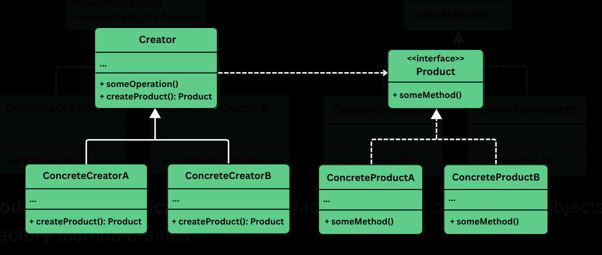

## Factory

> Provides an interface for creating objects in a superclass, but allows subclasses to alter the type of objects that will be created.

It is useful where:
- The exact type of objects to be created is not known until runtime.
- Object creation logic is complex, repetitve or needs encapsulation.
- Want to follow OCP.

When there are objects of similar type, we might start with conditonal logic to decide which objects to create. But as the application grows, this approach becomes rigid, harder to test, tightly couples our code to specific classes.

## The problem

We are building a backend to send notification to users. At first we are sending email notifications only.

```java
class EmailNotification {
    public void send() {
        System.out.println("Sending an Email notification...");
    }
}
```

Then use it in the `NotificationService`.

```java
class NotificationService {
    public void sendNotification(String message) {
        EmailNotification email = new EmailNotification();
        email.send(message);
    }
}
```

But then comes a new requirement to support SMS notification. Then we add an `if-else` block.

```java
class NotificationService {
    public void sendNotification(String type, String message) {
        if (type.equals("EMAIL")) {
            EmailNotification email = new EmailNotification();
            email.send(message);
        } else if (type.equals("SMS")) {
            SMSNotification sms = new SMSNotification();
            sms.send(message);
        }
    }
}
```

Then the product wants to send push notifications to mobile devices. Then marketing team wants to WhatsApp and Slack alterts.

Now the notification code, looks like a giant control tower. It is responsible for creating every kind of notification, knowing how each one works, decide which to send based on the type.

- To add a new notificaion channel, we are modifying the same core logic.
- Testing becomes cumbersome because the logic is intertwined with object creation.
- Violates OCP.

## Using a simple factory

This is not a formal pattern in the `GoF` book. But its still practical and widely used refactoring techniques in real world codebases.

Eg: The notification service no longer needs to know which concrete class to instantiate. It simply asks the factory for the right type of notification.

```java
class SimpleNotificationFactory {
    public static Notification createNotification(String type) {
        return switch (type) {
            case "EMAIL" -> new EmailNotification();
            case "SMS" -> new SMSNotification();
            case "PUSH" -> new PushNotification();
            default -> throw new IllegalArgumentException("Unknown type");
        };
    }
}
```

And now NotificationService is cleaner:

```java
class NotificationService {
    public void sendNotification(String type, String message) {
        Notification notification = SimpleNotificationFactory.createNotification(type);
        notification.send(message);
    }
}
```

This is better but it's **still not open to extension** w/o modification. We are still hard coding the decision logic and centralizing creation in one place.

We need to give each type of notification **its own responsibility for knowing how to create itself**.

## Applying the pattern

Instead of putting the burden of decision making in a single place, we distribute object creation responsibilities across the system in a clean organized way.



```java
interface Notification {
    public void send(String message);
}

class EmailNotification implements Notification {
    @Override
    public void send(String message) {
        System.out.println("Sending email: " + message);
    }
}

class SMSNotification implements Notification {
    @Override
    public void send(String message) {
        System.out.println("Sending SMS: " + message);
    }
}
```

Now create an abstract class with `createNotification()`. Optionally include the high level logic of sending a notification by using whatever object `createNotification()` provides.

```java
abstract class NotificationCreator {
    public abstract Notification createNotification();

    public void send(String message) {
        Notification notification = createNotification();
        notification.send(message);
    }
}
```

> The abstract creator defines the flow, not the details.

Now define concrete creators

```java
class EmailNotificationCreator extends NotificationCreator {
    @Override
    public Notification createNotification() {
        return new EmailNotification();
    }
}

class SMSNotificationCreator extends NotificationCreator {
    @Override
    public Notification createNotification() {
        return new SMSNotification();
    }
}
```

Each one extends the abstract creator and implements the `createNotification()` method to return its specific notification type.

- EmailNotificationCreator returns `new EmailNotification()`.
- SMSNotificationCreator returns `new SMSNotification()`.

No more conditionals, each class knows what it needs to create, and the core system doesn't need to care.

```java
public class FactoryMethodDemo {
    public static void main(String[] args) {
        NotificationCreator creator;

        // Send Email
        creator = new EmailNotificationCreator();
        creator.send("Welcome to our platform!");

        // Send SMS
        creator = new SMSNotificationCreator();
        creator.send("Your OTP is 123456");

        // Send Push Notification
        creator = new PushNotificationCreator();
        creator.send("You have a new follower!");
    }
}
```
