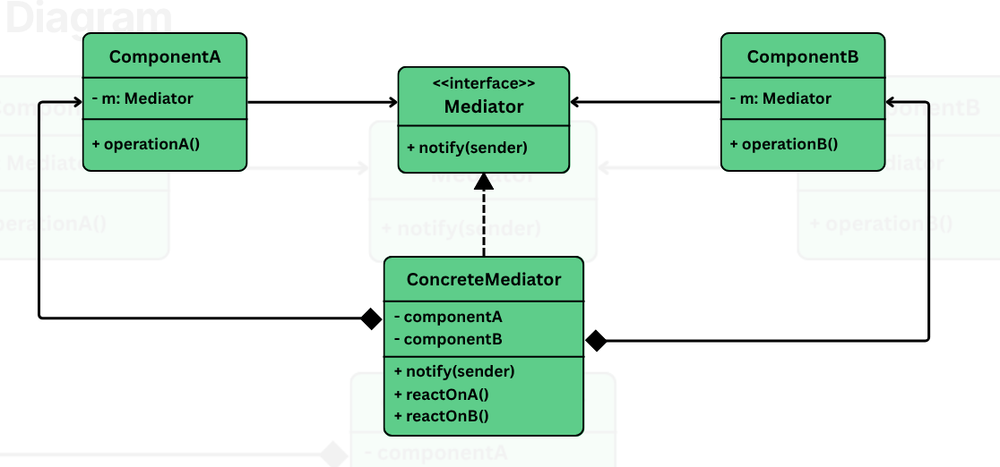

## Mediator

> A behavioral pattern that defines an object (the mediator) to encapsulate how a set of objects interact.

It promotes **loose coupling** by preventing objects from referring each other directly; lets us vary their interactions independently.

It is useful in situations:
- We have a group of tightly coupled classes or UI components that need to communicate.
- Changes in one component requires update in multiple others.
- We want to centralize communication logic to simplify maintenance and testing.

When classes depend on each other directly, their interactions often become tangled. Eg: GUI form where a user types into a field, may enable or disable a button, update label, trigger validation -- each component talks to others directly.

But as more components are added this direct communication becomes hard to manage, creates spaghetti code, each component ends up handling its own logic plus knowledge of how to coordinate with others.

> Mediator solves this by introducing a central object that handles communication b/w components. Each component only interacts with the mediator, which coordinates and manages interactions -- reducing coupling and simplifying each component's logic.

## The problem

Imagine building a login form with following fields/components:
- Username
- Password
- Login button
- Status

The logic of the form is simple:
- The login button should be enabled only when both username/password fields are non-empty.
- When the button is clicked, it should attempt login and display the result in status lable.

If we try to make components try to talk to each other:

```java
class TextField {
    private String text = "";
    private Button loginButton;

    public void setLoginButton(Button button) {
        this.loginButton = button;
    }

    public void setText(String newText) {
        this.text = newText;
        System.out.println("TextField updated: " + text);
        if (loginButton != null) {
            loginButton.checkEnabled();
        }
    }

    public String getText() {
        return text;
    }
}

class Button {
    private TextField usernameField;
    private TextField passwordField;
    private Label statusLabel;

    public void setDependencies(TextField username, TextField password, Label status) {
        this.usernameField = username;
        this.passwordField = password;
        this.statusLabel = status;
    }

    public void checkEnabled() {
        boolean enable = !usernameField.getText().isEmpty() &&
            !passwordField.getText().isEmpty();
        System.out.println("Login Button is now " + (enable ? "ENABLED" : "DISABLED"));
    }

    public void click() {
        if (!usernameField.getText().isEmpty() && !passwordField.getText().isEmpty()) {
            System.out.println("Login successful!");
            statusLabel.setText("✅ Logged in!");
        } else {
            System.out.println("Login failed.");
            statusLabel.setText("❌ Please enter username and password.");
        }
    }
}
```

At first glance, this looks fine but as we keep on adding more components (eg: remember me checkbox, forgot password link), the logic starts to spiral out of control.

### Tight coupling 

Every component knows about each other. A change in one component logic often requires updates in others -- creating a fragile system.

#### Lack of reusability

We can't easily reuse these components elsewhere. They are hard wired to interact with specific peers, make them **context dependent**.

#### Poor maintainability

Adding/modifying interactions requires changing the logic of multiple classes. This violates the OCP, makes the system harder to test and evolve.

#### Hidden logic sprawled across components

Each component contains not only its own logic, but also cooridating behavior, making it harder to isolate responsibilities.

## Applying the pattern

> The mediator pattern promotes loose coupling be centralizing communication b/w objects. Instead of having components refer and interact with each other directly, they communicate through a mediator.



### Mediator interface

Declares a method (commonly `notify()`, `componentChanged()`, `send() `etc.) used by components to send events to the mediator.

### Concreate Mediator

Implements mediator interface and coordinates communication b/w registered components. It holds the references of all the components its manages.

### Component base class (optional)

An abstract class or interface for UI elements or modules. It holds a reference to the mediator and delegates communication throught it.

### Concreate components

These are actual components (eg: `TextField`, `Button`, `Label`) that performs actions and notify the mediator when changes occur. They never talk directly to each other.

## What was achieved

- **Loose coupling**: Components no longer know about each other
- **Separation of concerns**: Coordinating logic lives in the mediator, not in the components.
- **Ease of extension**: Add new components or behaviors without modifying existing ones.
- **Reusability**: Individual components can be used in other contexts as well.
