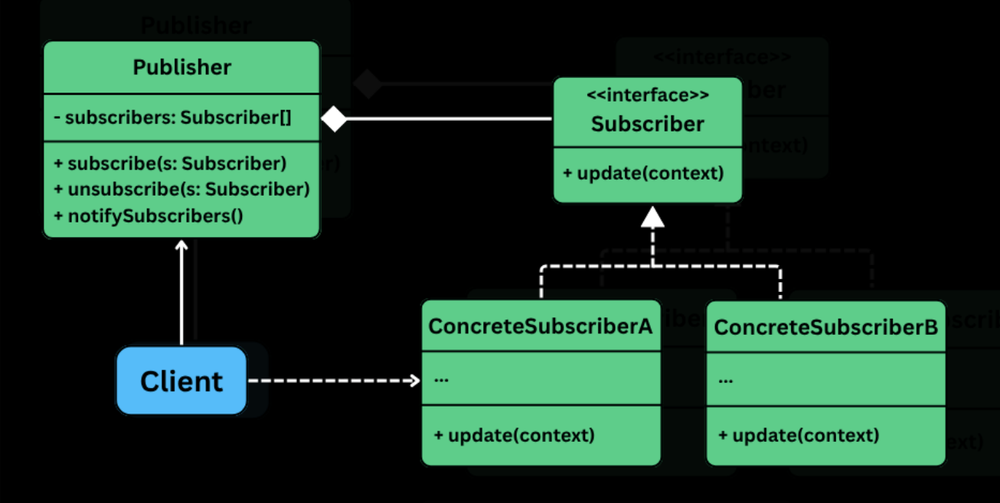

## Observer Design Pattern

A behavioral pattern that **defines a one-to-many dependency** b/w objects. So that when one object (the subject) changes its state, all its dependents (observer) are automatically notified and updated.

It is useful in situations:
- When there are multiple parts of the system that need to react to a change in one central component.
- Decouple the publisher of data from the subscribers who react to it.
- Need a dynmaic, event driven communication model w/o hardcoding who is listening to whom.

A straightforward appraoch is to directly call update methods on other objects whenever something changes. Eg: `NewsPublisher` might call `update()` on a `MobileApp`, `EmailService` and `WebsiteFeed`, every time a new article is published.

But as the # of subscribers grow, this approach becomes rigid, hard to scale, violates OCP -- adding or removing subscribers requires modifying the publisher class. It also tightly couples the publisher to all subscribers.

## The problem

Consider a Fitness Tracker App that connects to a wearable device and receives real-time fitness data -- steps taken, mintues active, calories burned.

Whenever new data is received from the device, it is pushed into a central object -- say `FitnessDataNaive`. 

```java
interface FitnessDataObserver {
    void update(FitnessDataNaive data);
}

class LiveActivityDisplayNaive {
    public void showStats(int steps, int minutesActive, int calories) {
        System.out.println(steps, minutesActive, calories);
    }
}

class ProgressLoggerNavie {
    public void logDataPoint(int steps, int minutesActive, int calories) {
        System.out.println("NAIVE Logger: Saving data - Steps: " + steps +
            ", Active Mins: " + activeMinutes +
            ", Calories: " + calories);
        // ... actual database or file logic
    }
}

class NotificationServiceNaive {
    private int stepGoal = 10000;
    private boolean dailyStepGoalNotified = false;

    public void checkAndNotify(int currentSteps) {
        if (currentSteps >= stepGoal && !dailyStepGoalNotified) {
            System.out.println("NAIVE Notifier: ALERT! You've reached your " + stepGoal + " step goal!");
            dailyStepGoalNotified = true;
        }
        // ... other notification logic, e.g., inactivity alerts ...
    }

    public void resetDailyNotifications() {
        dailyStepGoalNotified = false;
    }
}

class FitnessDataNaive {
    private int steps;
    private int activeMinutes;
    private int calories;

    // Direct, hardcoded references to all dependent modules
    private LiveActivityDisplayNaive liveDisplay = new LiveActivityDisplayNaive();
    private ProgressLoggerNaive progressLogger = new ProgressLoggerNaive();
    private NotificationServiceNaive notificationService = new NotificationServiceNaive();

    public void newFitnessDataPushed(int newSteps, int newActiveMinutes, int newCalories) {
        this.steps = newSteps;
        this.activeMinutes = newActiveMinutes;
        this.calories = newCalories;

        System.out.println("\nFitnessDataNaive: New data received - Steps: " + steps +
            ", ActiveMins: " + activeMinutes + ", Calories: " + calories);

        // Manually notify each dependent module
        liveDisplay.showStats(steps, activeMinutes, calories);
        progressLogger.logDataPoint(steps, activeMinutes, calories);
        notificationService.checkAndNotify(steps);
    }

    public void dailyReset() {
        // Reset logic...
        if (notificationService != null) {
            notificationService.resetDailyNotifications();
        }
        System.out.println("FitnessDataNaive: Daily data reset.");
        newFitnessDataPushed(0, 0, 0); // Notify with reset state
    }
}

public class FitnessAppNaiveClient {
    public static void main(String[] args) {
        LiveActivityDisplayNaive display = new LiveActivityDisplayNaive();
        ProgressLoggerNaive logger = new ProgressLoggerNaive();
        NotificationServiceNaive notifier = new NotificationServiceNaive();

        FitnessDataNaive fitnessData = new FitnessDataNaive(display, logger, notifier);

        fitnessData.newFitnessDataPushed(500, 5, 20);
        fitnessData.newFitnessDataPushed(9800, 85, 350);
        fitnessData.newFitnessDataPushed(10100, 90, 380); // Goal should be hit
        fitnessData.dailyReset();
    }
}
```

#### Tight coupling

The `FitnessDataNaive` is tightly coupled to the specific implementation of all observers. It must know all the dependent modules, maintain direct references of all observers, call their methods directly.

> If we change one of these modules, we likely have to modify `FitnessDataNaive` as well.

#### Violdate OCP

Adding a new feature like `WeeklySummaryGenerator`, needs changes to the `newFitnessDataPushed` and `FitnessDataNaive`.

Every time a new observer is added, the subject class must be modified -- violating OCP.

#### Inflexible and static design

The `NotificationService` or `ProgressLogger` can’t be added or removed at runtime. What if the user disables notifications in their settings.

Then we have to add conditions to manually enable/disable parts of the code -- making things fragile and error prone.

#### Responsibility

`FitnessDataNaive`, which should be solely focused on managing fitness metrics, is now responsible for:
- Calling UI update methods.
- Perform data logging.
- Sending notifications.

It is doing too much, violating the SRP and making the class harder to test, maintain or reuse.

#### Scalability Bottlenecks

As the module grows, `newFitnessDataPushed()` turns into a **giant block of update calls**. Each update might require specific parameters or conditonal logic, making it increasingly complex rigid.

## Applying the pattern

### What is needed?

- Loose coupling b/w the subject and observers.
- `FitnessData` to **broadcast changes to multiple listeners**, w/o knowing who they are.
- Each module to un/subscribe dynamically.
- Each module to decide for itself; how to responsd to changes.

> The observer pattern solves this by decoupling subject from its 
observers, allowing them to interact through a common interface. Observers can be added/removed at runtime. The subject doesn't need to know who they are; they just need to implement a specifc interface.



### Observer interface (FitnessDataObserver)

- Delcares and `update()` method.
- All modules that want to **listen to fitness data change**, will implement this method.
- Each observer defines its own logic inside `update()` to respond to updates.

### Subject interface (FitnessDataSubject)

- `registerObserver()`: subscribe to updates.
- `removeObserver()`: unsubscribe from updates.
- `notifyObservers()`: notify all current observers of a change.

The subject **does not care who the observers are** -- it just sends updates.

### Concrete Subject (FitnessData)

- Implements `FitnessDataSubject`.
- Maintains an internal list of `FitnessDataObserver` objects.
- When data is pushed, it updates its internal state and calls `notifyObservers()` to broadcast the change.

### Concrete Observers (eg: LiveActivityDisplay)

- Implements `FitnessDataObserver`.
- When `update()` is called, each observer pulls relevant data from the subject and performs its own logic (Eg: update UI, log progress, send alerts).

## What was achieved

- **Loose coupling**: `FitnessData` does not care who is listening -- it just broadcasts.
- **Extensibility**: Adding a new observer only requires implementing `FitnessDataObserver` -- no changes to `FitnessData`.
- **Runtime flexibility**: Observers can be removed/added dynamically (eg: based on user settings).
- **Clean separation of concerns**: Each module/class is responsible for its own behavior and logic.
