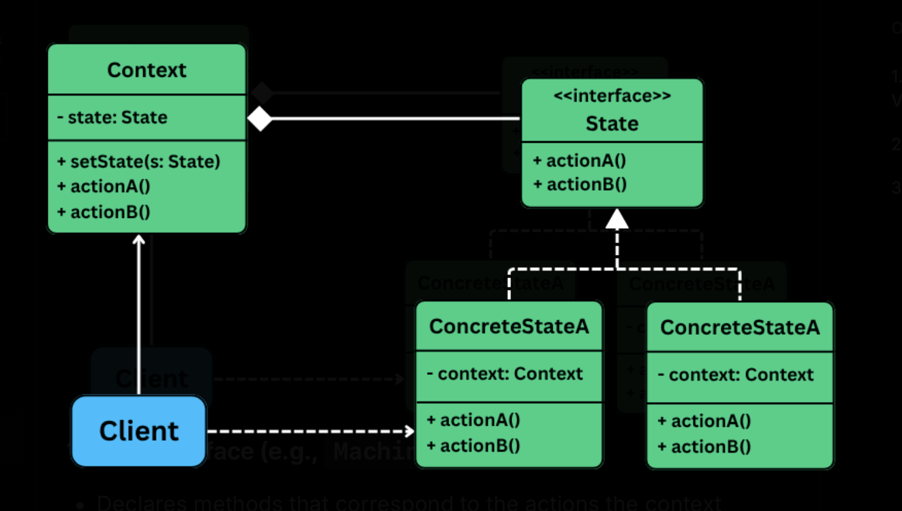

## State Design Pattern

> A behavioral pattern that lets and object change its behavior when its interal state changes, as if it were switching to a different class at runtume.

This is useful in situations where:
- An object can be in one of **many distinct states**, each with different behavior.
- The object's behavior depends on the **current context**, and the context **changes over time**.
- Avoid large `if-else` or `switch` statements that check for every possible state.

When faced with such scenario, developers often start using conditional logic inside a class to switch behavior based on the state variables.

Eg: A document class using `if-else` to determine what to do based on whether its in a "Draft", "Review" or "Published" state.

But as the # of states grow, this approach is hard to scale, difficult to test, violates O/C principle -- any new state requires modifying existing logic, increasing the risk of breaking current functionality.

## The problem

Image we are building a **vending machine system**. On the surface, it seems like a straightforward task: accept money, dispense product, go back to idle state. But behind the scenese, the machine's behavior needs to vary depending on its current state.

A navie approach would be to manage the state transitions manually inside a monolith `VendingMachine` class using `if-else` and `switch` statements.

```java
class VendingMachine {

    private enum State {
        IDLE, ITEM_SELECTED, HAS_MONEY, DISPENSING
    }

    private State currentState = State.IDLE;
    private String selectedItem = "";
    private double insertedAmount = 0.0;

    public void selectItem(String itemCode) {
        switch (currentState) {
            case IDLE:
                selectedItem = itemCode;
                currentState = State.ITEM_SELECTED;
                break;
            case ITEM_SELECTED:
                System.out.println("Item already selected");
                break;
            case HAS_MONEY:
                System.out.println("Payment already received for item");
                break;
            case DISPENSING:
                System.out.println("Currently dispensing");
                break;
        }
    }

    public void insertCoin(double amount) {
        switch (currentState) {
            case IDLE:
                System.out.println("No item selected");
                break;
            case ITEM_SELECTED:
                insertedAmount = amount;
                System.out.println("Inserted $" + amount + " for item");
                currentState = State.HAS_MONEY;
                break;
            case HAS_MONEY:
                System.out.println("Money already inserted");
                break;
            case DISPENSING:
                System.out.println("Currently dispensing");
                break;
        }
    }

    public void dispenseItem() {
        switch (currentState) {
            case IDLE:
                System.out.println("No item selected");
                break;
            case ITEM_SELECTED:
                System.out.println("Please insert coin first");
                break;
            case HAS_MONEY:
                System.out.println("Dispensing item '" + selectedItem + "'");
                currentState = State.DISPENSING;

                // Simulate delay and completion
                try {
                    Thread.sleep(1000);
                } catch (InterruptedException e) {
                    Thread.currentThread().interrupt();
                }

                System.out.println("Item dispensed successfully.");
                resetMachine();
                break;
            case DISPENSING:
                System.out.println("Already dispensing. Please wait.");
                break;
        }
    }

    private void resetMachine() {
        selectedItem = "";
        insertedAmount = 0.0;
        currentState = State.IDLE;
    }
}
```

### Whats wrong here

#### Cluttered code

All state related logic is stuffed into one class (`VendingMachine`), resulting in a large and repetitive `switch` or `if-else` blocks across every method.

This leads to duplicate checks for state across multiple methods, fragile logic when developers touch the same file.

#### Hard to extend

Suppose we want to introduce a new state eg: `OutOfStockState`. We have to **update every switch block** in every method; add logic in multiple places and risk breaking existing functionality.

## Applying the pattern

> The state pattern solves this by encapsulating **each state into its own class**, letting the context object **delegate the behavior to the current state object**.

This makes the code easier to extend, reuse and maintain -- w/o cluttering the core logic conditionals. At any given time the machine can only be in one state:
- `IdleState`: waiting for user input; nothing selected; no money entered.
- `ItemSelectedState`: an item has been selected; waiting for payment.
- `HasMoneyState`: money has been inserted; waiting to dispense item.
- `DispenseState`: machine is actively dispensing the item.

The machine supports human facing operations like -- `selectItem(String itemCode)`, `insertCoint(double amount)`, `dispenseItem()`.

Eg:
- Calling `dispenseItem()` when the machine is in `IdleState` should do nothing or throw an error.
- Calling `insertCoin()` before selecting an item might be disallowed or queued.
- Calling selectItem() during DispensingState should be ignored or deferred until the item is dispensed.



#### State interface (eg: MachineState)

- Declares the methods that corresponds to the actions the context supports (eg: `selectItem(), insertCoin(), dispenseItem()`).
- These methods often take context as parameter, so the state can trigger transitions or manipulate context data.
- Acts as a contract for all the concrete states.

#### Concrete class (eg: IdleState, ItemSelectedState)

- Implements the `MachineState` interface.
- Define **state specific behavior** for each action.
- Often responsible for **transitioning the context to another state** when a specific action occurs.
- Can also include state specific logic (eg: validation, messaging).

#### Context (eg: VendingMachine)

- Maintains a reference to the current state `State` object.
- Delegates call to the current state -- the state object handles the logic.
- Provides a method like `setState()` to allows transition b/w states.

## What was achieved

By using the pattern, we transformed a rigid, condition heavy implementation into a clean, flexible architecture where behaviors and transitions are clearly defined, decoupled, and easy to maintain.
