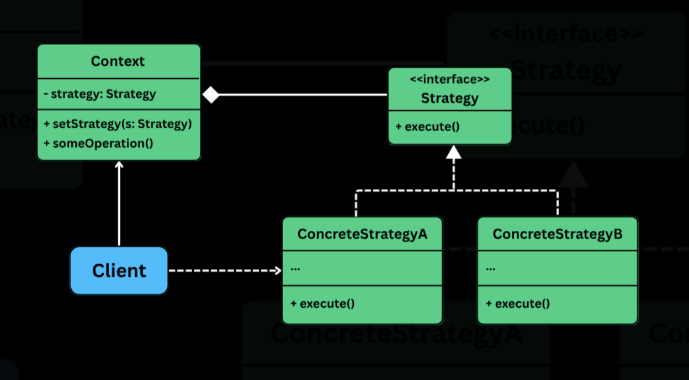

## Strategy Design Pattern

> Strategy is a behavioral pattern that lets us define a family of algorithms, put each one into a separate class and makes their objects interchangeable -- allowing the algorithm to vary independently from the clients that use it.

It is useful in situations where:
- Multiple ways to perform a task or calculation.
- The behavior of the class needs to change dynamically at runtime.
- Avoid cluttering of the code with conditional logic (if-else/switch) for every variation.

When we have multiple ways to do achieve the same goal, we can use branching logic inside a class to handle different cases. Eg: `PaymentService` might use `if-else` to choose b/w credit card, cash or UPI.

But as more payment methods are added, this approach becomes hard to scale, violates O/C principle, makes the code harder to test and maintain.

## The problem

Imagine we are building a shipping cost calculator for an e-commerce platform. Shipping charges can vary based on business rules:
- Flat rate: A fixed fee (eg: $10 per shipment, regardless of weight or destination).
- Weight based: Calculated per kilogram.
- Distance based: Rates based on zones (eg: Zone A = $5, Zone B = $12).
- Thrid party API: fetch dynamic rates from providers like FedEx or UPS.

A naive solution would look something like this:

```java
// Shipping cost calculator
class ShippingCostCalculatorNaive {
    public double calculateShippingCost(Order order, String strategyType) {
        double cost = 0.0;

        if ("FLAT_RATE".equalsIgnoreCase(strategyType)) {
            System.out.println("Calculating with Flat Rate strategy.");
            cost = 10.0;

        } else if ("WEIGHT_BASED".equalsIgnoreCase(strategyType)) {
            System.out.println("Calculating with Weight-Based strategy.");
            cost = order.getTotalWeight() * 2.5;

        } else if ("DISTANCE_BASED".equalsIgnoreCase(strategyType)) {
            System.out.println("Calculating with Distance-Based strategy.");
            if ("ZoneA".equals(order.getDestinationZone())) {
                cost = 5.0;
            } else if ("ZoneB".equals(order.getDestinationZone())) {
                cost = 12.0;
            } else {
                cost = 20.0;
            }

        } else if ("THIRD_PARTY_API".equalsIgnoreCase(strategyType)) {
            System.out.println("Calculating with Third-Party API strategy.");
            cost = 7.5 + (order.getOrderValue() * 0.02);

        } else {
            throw new IllegalArgumentException("Unknown shipping strategy: " + strategyType);
        }

        System.out.println("Calculated Shipping Cost: $" + cost);
        return cost;
    }
}

// Client code
public class ECommerceAppV1 {
    public static void main(String[] args) {
        ShippingCostCalculatorNaive calculator = new ShippingCostCalculatorNaive();
        Order order1 = new Order();

        System.out.println("--- Order 1 ---");
        calculator.calculateShippingCost(order1, "FLAT_RATE");
        calculator.calculateShippingCost(order1, "WEIGHT_BASED");
        calculator.calculateShippingCost(order1, "DISTANCE_BASED");
        calculator.calculateShippingCost(order1, "THIRD_PARTY_API");
        // What if we want to try a new "PremiumZone" strategy?
        // We have to go modify this calculator class again...
    }
}
```

This may seem fine intially, this design quickly becomes brittle and problematic as the system evolves.

#### Bloated if-else

The if-else chain becomes increasingly large and unreadable as more strategies are introduced. It clutters the code and makes debugging harder.

#### Difficult to test in isolation

Each strategy is strangled inside one method, making it harder to test individual behaviors indpendently. We need to setup entire `Order` object and manually select the strategy type just to test one case.

#### Risk of code duplication

If different services (eg: checkout, returns, logistics etc.) use similar logic, we may end up duplicating thes conditional blocks in multiple places.

#### Low cohesion

The calculator class knows too much. It knows how to handle every possible algorithm for shipping cost, rather than focusing on orchestrating the calculation.

> The Strategy Pattern solves this by encapsulating each behavior in its own class and delegating the responsibility to the right strategy at runtime -- keeping the core logic clean, extensible, and testable.

## Applying strategy

> The Strategy pattern defines a family of algorithms, encapsulates each one, and makes them interchangeable

Rather than hardcoding logic with `if-else`, we can delegate the behavior to strategy objects.



#### Strategy interace (eg: ShippingStrategy)

A common method that declares the algorithm's method. All concrete strategies implement this interface.

#### Concrete strategies (eg: FlatRateShipping, WeightBasedShipping)

Individual implementaion of the `Strategy` interface. Each class encapsulates a different algorithm.

#### Context class (eg: ShippingCostService)

It holds a reference to the `Strategy` object and delegates the calculation to it. The context doesn't which specific strategy is being used -- it just knows it has a strategy that can calculate a shipping cost.

#### Client

Creates appropriate concrete strategy instance; passes it to the `Context`; changes the strategy of the `Context` at runtime (if needed).

## What was achieved

- No conditional logic inside `ShippingCostStrategy`.
- Strategies are encapsulated, reusable and easy to test.
- Adding new strategy only requires a new class -- no change to the service or existing logic.
- We can switch strategies at runtime w/o breaking any existing functionality.

> This separates - what you do from how you do it, leading to clean, extensible and maintainable code.
